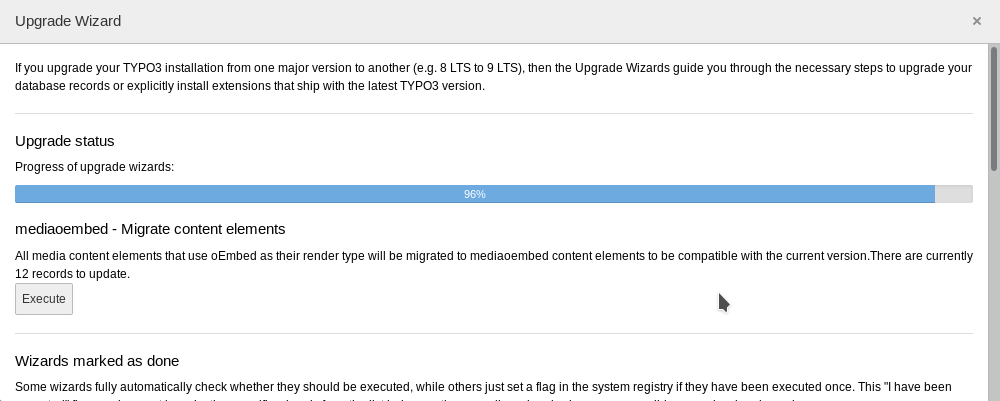

.. ==================================================
.. FOR YOUR INFORMATION
.. --------------------------------------------------
.. -*- coding: utf-8 -*- with BOM.

.. include:: ../Includes.txt

.. _admin-manual:

Administrator Manual
====================

.. _admin-installation:

Installation
------------

Import the extension in the extension manager and install it. If you don't want to set up all providers on your own
import the static data and you will have a large number of providers per-configured.

The extension requires at least TYPO3 version 6.2.1.

Hint! This extension will not work with TYPO3 4.x and older 6.x versions any more. You can find older versions in the
Github repository.

.. _admin-update:

Update
------

The database structure and the TYPO3 integration have changed very much between version 0.0.1 and 0.1.0! In the current
version a new content type is used for embedding external media called “External Media”. The media data is stored in
some new database fields in the tt_content table and not in the media FlexForm any more.

After updating the Extension please use the Update wizard in the Install tool to upgrade you existing media elements to
the new version. There are two steps you need to execute in the following order:

#. mediaoembed - Create required columns
#. mediaoembed - Migrate content elements

   The update steps in the install tool

That's it. You can now use the new version of the mediaoembed Extension and all your existing contents are migrated.

.. _admin-manage-providers:

Manage providers
----------------

Switch to the "List" module and select the root of your TYPO3 installation in the page tree. Scroll down to the
oEmbed providers table. There you can:

- create new providers
- edit existing providers
- change the order of providers

You might ask yourself "Why should I change the order of the providers?". To answer this you need to know how
mediaoembed resolves the provider for a mediaurl:

- each provider has a number of URL schemes he is responsible for
- to resolve the correct provider all providers will be traversed and all their URL schemes will be checked if they
match the current media URL
- the order in which the providers are checked depends on the order in the backend

So if you have a provider that you will use very often you can improve the performance of the lookup process by
moving this provider to the top.

Note! No benchmarks have been done yet to monitor the performance impact of the provider order. Maybe it is so
small that you do not need to care...

.. _admin-edit-provider:

Editing a provider
------------------

A provider has a number of properties that will be explained in this chapter.

Disable
~~~~~~~

Good old disable property. When you set this the provider will not be available for your content editors. If they
use URLs from this provider and there is no other provider that can also handle this type of URL they will get an error.

Provider name
~~~~~~~~~~~~~

This is the readable name of the provider. It will be used as the title of the provider record in the backend and is
also accessible during the rendering process of the media content element.

Is generic
~~~~~~~~~~

This property marks a provider as “generic” which means the provider can serve embed codes for multiple content
providers. Providers with this property will be listed as options for the “Use generic providers” property. Normally
generic providers will not have any own URL schemes attached to them.

Description
~~~~~~~~~~~

Here you can put in a description for the provider which will also be available during the rendering process
of the media content element. This might be useful if you want to provide more information about the used
provider to your website users.

URL schemes
~~~~~~~~~~~

Here you can put in the URL schemes this provider is responsible for (one scheme per line). At the moment
you can only use the asterisk (*) as a wildcard.

Endpoint URL
~~~~~~~~~~~~

This is the URL where the query will be sent to and that should provide the embed code to us.

Use generic providers
~~~~~~~~~~~~~~~~~~~~~
Here you can select a generic provider. You can use this either in combination with the endpoint URL or on
it's own. If you combine it the endpoint URL will have priority. Only if the request to the native endpoint
will fail the generic providers will be used in the order you spcified.

embed.ly Shortname
~~~~~~~~~~~~~~~~~~

Http://embed.ly provides an API call that returns a list of all supported providers. One property of the results
is the shortname, which is unique for each provider. To make updates more easy in future, the embed.ly shortname
is stored here. Normally you will not need this.
