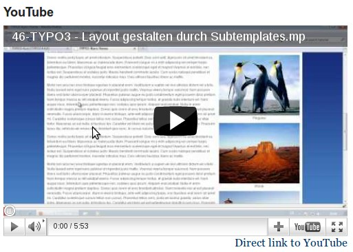

..  include:: /Includes.rst.txt

.. _introduction:

============
Introduction
============

.. _what-it-does:

What does it do?
================

This extension provides a new content type "External media". The editor only needs to provide the URL to
the media he wants to embed.

The media will then be embedded via an oEmbed request if a matching provider was found. For more
information on oEmbed see: https://oembed.com

Additionally the extension gives administrators the possibility to manage oEmbed providers. It comes with
a number of default providers out of the box.

.. _screenshots:

Screenshots
===========

   Editing an external media content element

   A YouTube video embedded with mediaoembed
