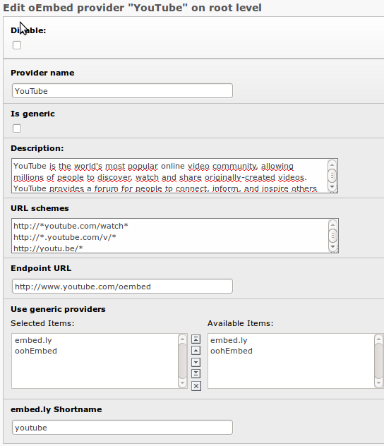

.. ==================================================
.. FOR YOUR INFORMATION
.. --------------------------------------------------
.. -*- coding: utf-8 -*- with BOM.

.. include:: ../Includes.txt

.. _introduction:

Introduction
============

.. _what-it-does:

What does it do?
----------------

This extension provides a new content type "External media". The editor only needs to provide the URL to
the media he wants to embed.

The media will then be embedded via an oEmbed request if a matching provider was found. For more
information on oEmbed see http://www.oembed.com/.

Additionally the extension gives administrators the possibility to manage oEmbed providers. It comes with
a huge amount of default providers out of the box.

Administrators have the possibility to use providers that have their own API like http://www.youtube.com/
or http://www.flickr.com/ but they can also use generic providers like http://embed.ly/ that can deliver
the embed code for many other providers.

.. _screenshots:

Screenshots
-----------

.. figure:: ../Images/ScreenshotContentElement.png
   :width: 389px
   :alt: A screenshot of a Backend form for editing an external media content element

   Editing an external media content element

   Editing a provider in the Backend

.. figure:: ../Images/ScreenshotFrontendYouTube.jpg
   :width: 513px
   :alt: A screenshot of a YouTube video embedded with mediaoembed

   A YouTube video embedded with mediaoembed

